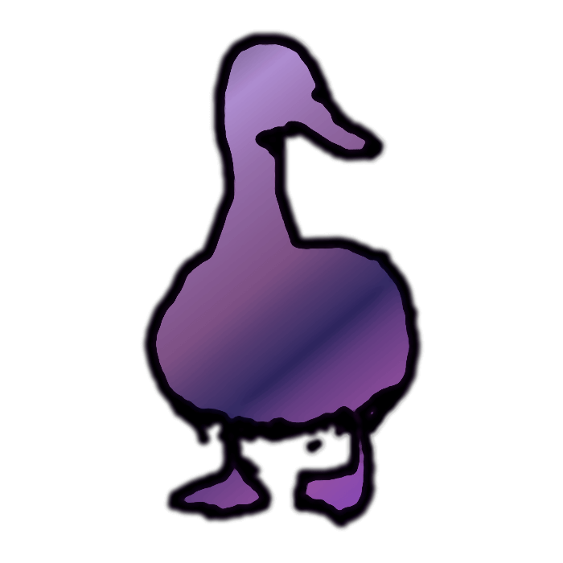
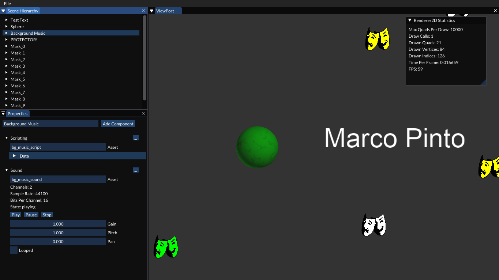

# Dempsta

## README

Dempsta is a personal project meant to learn step-by-step what it takes to build a game engine.

The idea is to make it as cross-platform as possible. Currently tested in Linux and Windows, using OpenGL as the only graphics API. Planned to add Vulkan and D3D.

Using Lua as scripting language.

Make sure to clone the repository with `--recursive` to fetch all the submodules.

### Compiling

#### Linux

Simply run:

- `$ ./build.py`  

**Note** : Using by default Ninja as the build system, can be changed to Make with `--make` option. Run `$ ./build.py -h` to see all the available options.

#### Windows

Simply run:

- `> build.py` in a command prompt for Visual Studio. Refer to [this](https://docs.microsoft.com/en-us/dotnet/framework/tools/developer-command-prompt-for-vs)

**Note** : You can also open the project in Visual Studio, build and run dempsta_editor exe, generate the solution with cmake or use CLion.

### Examples

Inside examples folder, lies an example scene parsed as json. Just use the editor `File` menu to load it.

### Tests

To compile and run the tests:

- `$ ./build.py -i -t`
- `$ ./test.py`
